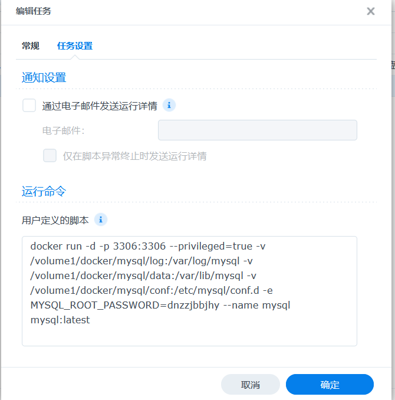
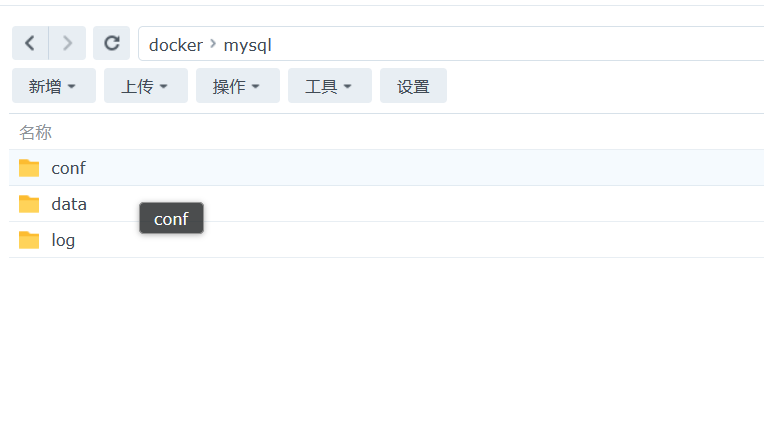
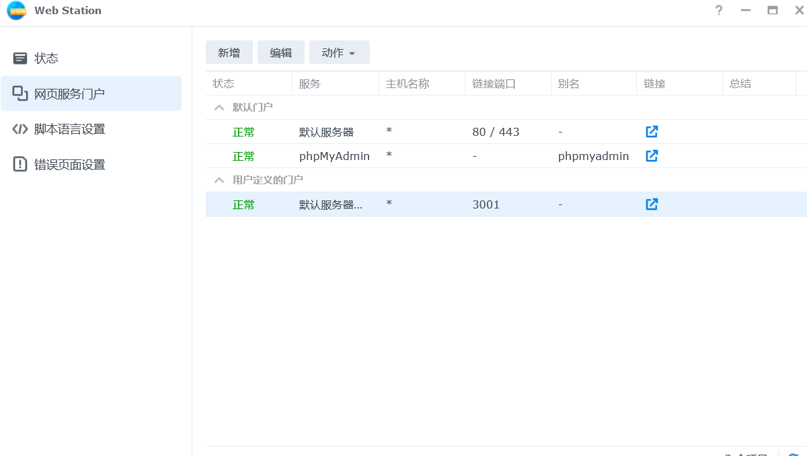
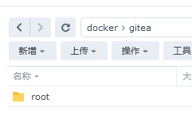
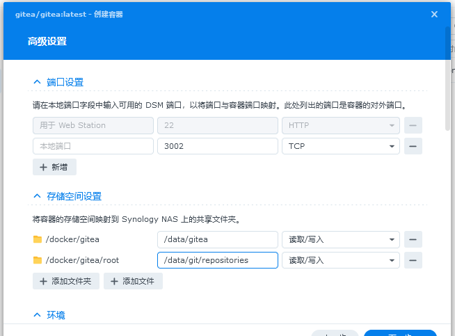
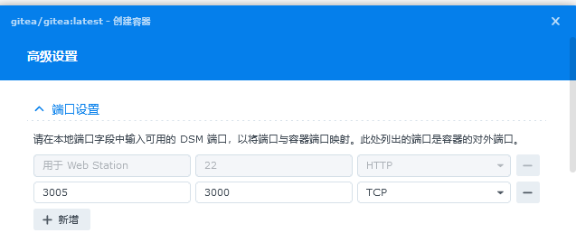
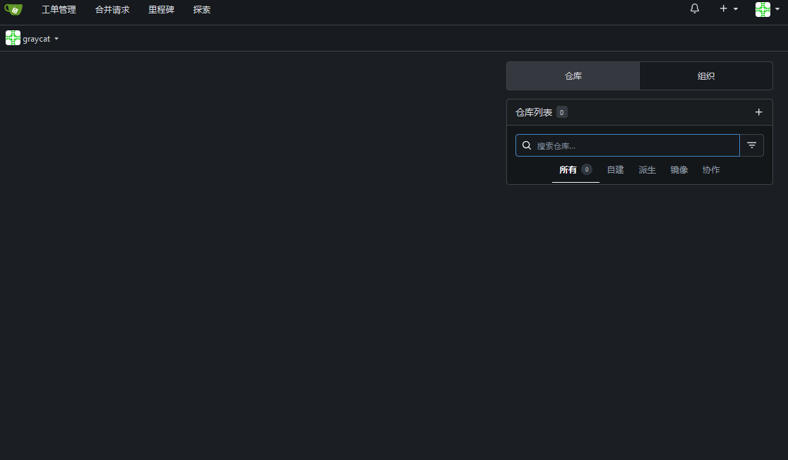

# 1. MySQL

控制面板——创建任务计划——新增——触发的任务——用户定义的脚本

root用户——不勾选已启用



```bash
docker run -d -p 3306:3306 --privileged=true -v 
/volume1/docker/mysql/log:/var/log/mysql -v 
/volume1/docker/mysql/data:/var/lib/mysql -v 
/volume1/docker/mysql/conf:/etc/mysql/conf.d -e MYSQL_ROOT_PASSWORD=dnzzjbbjhy --name mysql mysql:latest
```

映射目录，在docker目录下创建文件夹



运行任务，加入到docker容器，用phpmyadmin登录数据库


# 2. phpmyadmin

套件中心安装+部署docker

直接在注册表找，下载映像，新增容器

不要用webStation设置网页门户，会占掉80端口，不要配置存储空间，配了反而出问题。

环境加一个PMA_ARBITRARY=1

链接容器mysql

# 3. webstation

https://kb.synology.cn/zh-cn/DSM/help/WebStation/application_webserv_virtualhost?version=7

File Station——web——配置前端

配置端口：


Web Station 使用 http 群组来执行任务。

默认情况下，http 群组拥有 web 和 web_packages 共享文件夹的读取权限。若要确保 Web Station 正常工作，需要向 http 群组授予访问网站相关文件夹或文件的权限。例如，如果要让 web 共享文件夹中的 sample.htm 文件可供 Web Station 访问，需要确认 http 群组具有 web 共享文件夹及 sample.htm 文件的读/写权限。
主页文件的名称必须为 index.htm、index.html 或 index.php。
当使用 PHP mail() 功能时，系统会自动采集并使用控制面板 > 通知设置 > 电子邮件中的 SMTP 服务器信息。需确认已启用电子邮件通知并输入正确的 SMTP 服务器信息。
Web Station 默认情况下附带两个共享文件夹：
web_packages：已安装的第三方套件的文件（例如 phpMyAdmin）将存储在此共享文件夹中。
web：用于托管网站的文件可存储在此共享文件夹中。
web 共享文件夹的实际路径是 /volume1/web。有些应用程序会要求用户在配置文件中设置这个路径。
blog、photo、photosrc 和 webdefault 是系统保留的文件夹名称，无法由 Web Station 使用。请勿在 web 共享文件夹下创建具有这些名称的文件夹。

若要自定义错误页面，执行下列任一操作：
前往错误页面设置 > 默认配置文件 > 默认错误页面配置文件，并参阅错误页面设置以了解说明。
创建名为 missing.html、missing.htm 或 missing.php 的文件并置于 Synology NAS 的 web 共享文件夹下。

# 4. Git仓库

## Gitea

https://about.gitea.cn/

https://github.com/go-gitea/gitea

Go编写，MIT开源

在docker下新建文件夹docker——gitea——root



在注册表中搜索gitea，双击下载（在映像中下载）

在容器中创建容器，配置访问端口和存储空间



设置端口，第一个端口是nas的端口



链接mysql，配置初始信息，漫长的等待

芜湖




# 5. Docker notes

Docker是一个开源的应用容器引擎，让开发者可以打包他们的应用以及依赖包到一个可移植的镜像中，也可以实现虚拟化。容器是完全使用沙箱机制，相互之间不会有任何接口。

Docker-compose —— 官方容器编排工具

# 6. VPN

https://www.synology.com/en-us/support/download

(简体中文站下不到一些套件)

## 1） VPN sever

选择设备型号后到packages中找到VPN sever，下载spk文件

在nas套件中心选择手动安装，重启nas


## 2）clash

### 一种通过pc clash间接使用的方法

clash拥有 allow lan的功能，即局域网使用功能


1. 在clash中开启allow lan
2. cmd 中 输入ipconfig 查询本机ipv4地址（或者直接点这个三叉）。
3. 群晖 - 控制面板 - 网络 - 代理服务器 -  地址填写pc的ip地址；端口填写默认的clash 端口 7890（或者修改后的端口）
4. 勾选通过代理服务器连接，同时pc的clash开启proxy

### 在nas docker部署clash的方法

http://k.sina.com.cn/article_1823348853_6cae187502001b068.html

# 7. Browser

## 7.1 Chrome

最初是有需要通过nas访问内网设备的需求，最直接的方式就是在nas上装一个浏览器，但进一步发现了很多妙用，记录在nas运维笔记中。

